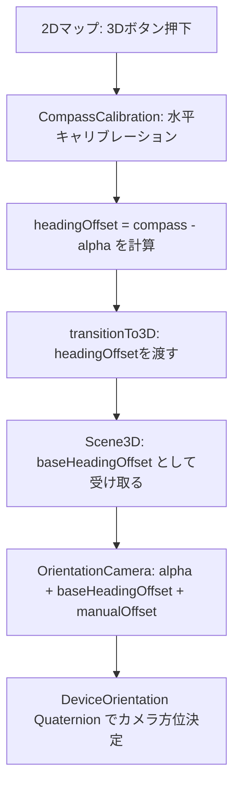

# 3Dビュー 方位（コンパス）システム

## 座標系

`coordinate-converter.ts` で定義されている3D空間の座標系:

| 軸 | 正方向 | 負方向 |
|----|--------|--------|
| X  | 東     | 西     |
| Y  | 上     | 下     |
| Z  | 南     | 北     |

Three.jsのデフォルトカメラ方向（-Z方向）を向いたとき、**北**を向いている状態。

## 方位の流れ（モバイルAR時）



### 1. キャリブレーション（`OkutamaMap2D.tsx`）
- `CompassCalibration` コンポーネントで端末を水平に保持させる
- 水平安定が確認されたら、その時点の `compassHeading` と `alpha` の差分を `headingOffset` として計算
- `headingOffset = (compassHeading + manualOffset) - alpha` （0-360正規化）

### 2. OrientationCamera（`OrientationCamera.tsx`）
- ARモード時、標準的な `DeviceOrientationControls` のQuaternion計算ロジックを使用
- `alpha + baseHeadingOffset + manualHeadingOffset` を実効的なalpha として利用
- Euler角 `(beta, alpha, -gamma, 'YXZ')` → Quaternion → `q_world` 適用 → 画面回転適用

### 3. q_worldの役割
```
q_world = Quaternion(-√0.5, 0, 0, √0.5)  // X軸周り -90°回転
```
端末が水平（テーブルの上）の状態から、縦に持った状態の座標変換を行う。

## コンパス方位の取得（`OrientationService.ts`）

| プラットフォーム | 方位取得方法 | 備考 |
|---|---|---|
| iOS | `webkitCompassHeading` | 絶対方位（磁北基準、時計回り） |
| Android | `alpha`（+ `absolute`フラグ） | 相対値の場合あり（実装依存） |

磁気偏角（`magneticDeclination = 7.3°`）を加算して真北に補正。

## 既知の問題・注意点

### 1. initialCameraConfig.rotation は即座に上書きされる
- `Scene3D` で `[0, Math.PI, 0]`（南向き）を初期値に設定
- `OrientationCamera` がフレームごとにカメラのQuaternionを `slerp` で上書き
- 初期の数フレームだけ南を向くが、すぐにデバイス方位に追従する

### 2. 水平時と縦持ち時のalpha挙動差
- キャリブレーション時は端末を水平にして `alpha` を取得
- 実際の使用時は端末を立てている（beta ≈ 90°）
- このポジション変更によって `alpha` の値が変動する可能性がある

### 3. Android の alpha 基準
- `absolute: true` のとき北基準、`false` のときページロード時の向きが基準
- `absolute: false` の場合、`baseHeadingOffset` の計算精度が低下する

### 4. 非ARモード（smoothing = 0.1）
- 傾きの10%だけを使用したマイルドな傾き表現
- 方位は反映されるがリアルタイム追従ではない

## PC モード（FPSカメラ）
- `FPSCameraControls`: マウスでヨー/ピッチ操作
- `PCKeyboardControls`: WASD + QE で移動
- 初期回転は `camera.rotation.y = Math.PI`（南向き）を引き継ぐ
- `camera.rotation.order = 'YXZ'` で設定

## 関連ファイル

- `src/components/ar/OrientationCamera.tsx` — カメラの方位制御
- `src/components/ui/CompassCalibration.tsx` — キャリブレーションUI
- `src/components/viewer/Scene3D.tsx` — 3Dシーン本体
- `src/components/map/OkutamaMap2D.tsx` — 2Dマップ（キャリブレーション実行）
- `src/services/sensors/OrientationService.ts` — コンパス方位計算
- `src/hooks/useSensors.ts` — センサーデータ管理
- `src/utils/coordinate-converter.ts` — GPS↔3D座標変換
